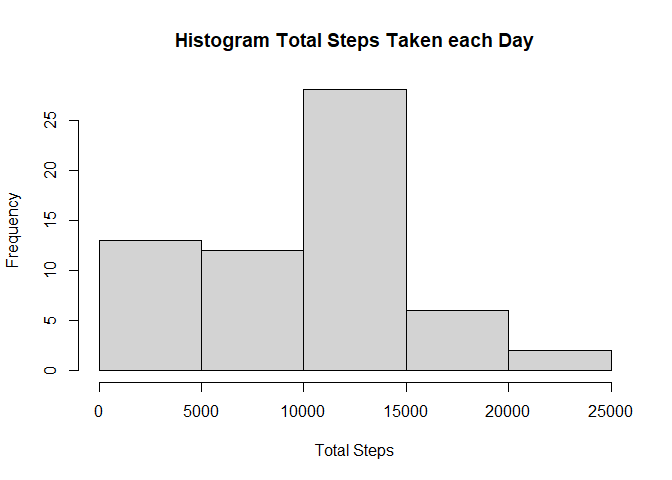
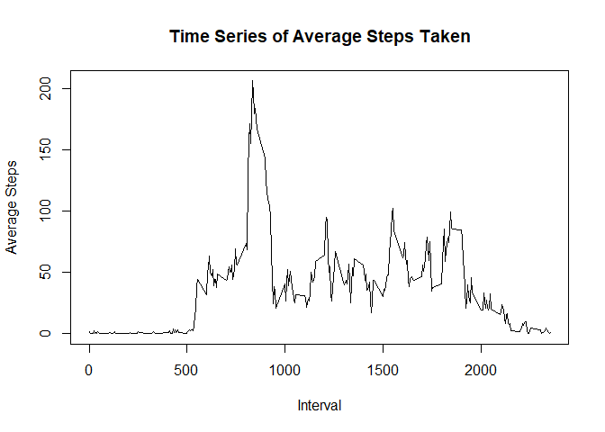
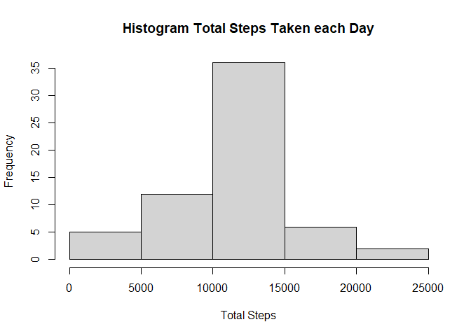
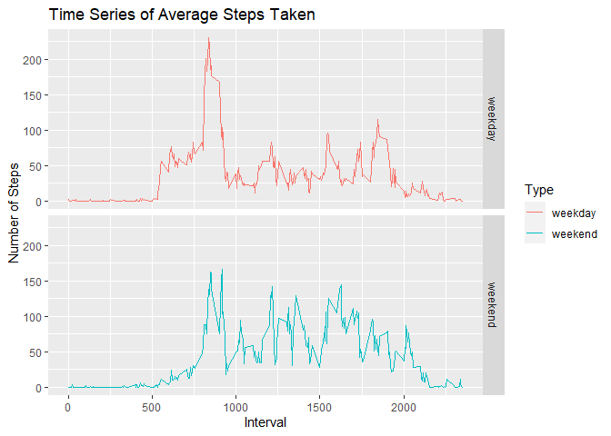

## Loading and preprocessing the data
Steps to load and process the data


```r
library(ggplot2)

      # unzip file if not already done and read csv
if (exists("activity.csv")) {
      activity <- read.csv("activity.csv")
}     else {
      unzip("./activity.zip")
      activity <- read.csv("activity.csv")
}

# summarize data, omit NA values & format fields
totalStepsbyDay <- with(activity,aggregate(steps, by = list(date),sum))
totalStepsbyDay <- na.omit(totalStepsbyDay)
colnames(totalStepsbyDay) <- c('Date','Steps')
totalStepsbyDay$Date <- as.Date(totalStepsbyDay$Date,"%Y-%m-%d")

# summarize data average daily activity pattern excluding NA values
avgDailyPattern <- with(activity,aggregate(steps, by = list(interval),mean, na.rm = TRUE))
colnames(avgDailyPattern) <- c('Interval','AvgSteps')
```


## What is mean total number of steps taken per day?


```r
hist(totalStepsbyDay$Steps, xlab = "Total Steps", 
     main = "Histogram Total Steps Taken each Day")
```

<!-- -->

Mean of total steps taken per day excluding NA values


```r
mean(totalStepsbyDay$Steps)
```

```
## [1] 10766.19
```

Median of total steps taken per day excluding NA values


```r
median(totalStepsbyDay$Steps)
```

```
## [1] 10765
```

## What is the average daily activity pattern?


```r
plot(avgDailyPattern$Interval,avgDailyPattern$AvgSteps,type = "l",
     xlab = "Interval", ylab = "Average Steps", main = "Time Series of Average Steps Taken")
```

<!-- -->

Which 5 minute interval on average contains max number of steps


```r
avgDailyPattern[which.max(avgDailyPattern$AvgSteps),]
```

```
##     Interval AvgSteps
## 104      835 206.1698
```

## Imputing missing values

Number of rows with NA as shown in summary of steps column


```r
summary(activity$steps)
```

```
##    Min. 1st Qu.  Median    Mean 3rd Qu.    Max.    NA's 
##    0.00    0.00    0.00   37.38   12.00  806.00    2304
```

Will utilize average by 5 minute interval to replace steps in the 2304 records having NA values in the steps field.  Steps to recreate new data set.


```r
# steps to calculate mean by interval and replace NA values with it
activity2 <- activity
activity2$newSteps <- ave(activity2$steps, activity2$interval, FUN = function(x)mean(x[!is.na(x)]))
activity2$steps <- ifelse(is.na(activity2$steps),activity2$newSteps,activity2$steps)
totalStepsbyDayClean <- with(activity2,aggregate(steps, by = list(date),sum))
colnames(totalStepsbyDayClean) <- c('Date','Steps')
totalStepsbyDayClean$Date <- as.Date(totalStepsbyDayClean$Date,"%Y-%m-%d")

hist(totalStepsbyDayClean$Steps, xlab = "Total Steps", 
     main = "Histogram Total Steps Taken each Day")
```

<!-- -->

Mean of total steps taken per day after imputing NA values


```r
mean(totalStepsbyDayClean$Steps)
```

```
## [1] 10766.19
```

Median of total steps taken per day after imputing NA values


```r
median(totalStepsbyDayClean$Steps)
```

```
## [1] 10766.19
```

Using the mean to replace NA values has cause mean and median values to be the same.


## Are there differences in activity patterns between weekdays and weekends?

Creating new factor variable to identify records as weekday or weekend


```r
# steps to calculate average pattern activity on imputed dataset
activity3 <- activity2
activity3$date <- as.Date(activity3$date,"%Y-%m-%d")
activity3$type <- factor(grepl("S.+",weekdays(activity3$date)),levels = c(FALSE,TRUE),
                         labels = c("weekday","weekend"))
avgDailyPatternClean <- with(activity3,aggregate(steps, by = list(interval,type),mean))
colnames(avgDailyPatternClean) <- c('Interval','Type','AvgSteps')
avgDailyPatternClean <- with(activity3,aggregate(steps, by = list(interval,type),mean))
colnames(avgDailyPatternClean) <- c('Interval','Type','AvgSteps')
```

Plot of data by weekend or weekday


```r
qplot(Interval,AvgSteps,data = avgDailyPatternClean, facets = Type~. , geom = "line",
      ylab = "Number of Steps", main = "Time Series of Average Steps Taken", colour = Type)
```

<!-- -->
